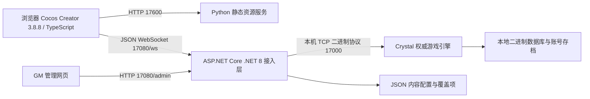

# 当前后端架构与本地服务恢复

2026-09-11。这是当前代码与运行状态说明，不是未来部署设计。

## 进程与数据流

- Python是独立静态资源进程，仅负责build/web和网页健康检查，不结算游戏。
- ASP.NET Core接入层与Crystal在**同一个Mir2.Headless进程**中；通过本机TCP适配现有协议，并非两个微服务。每个WebSocket会话由BridgeSession桥接身份和操作。
- Crystal负责人物、地图、AI、战斗、物品、经验、NPC与存档；当前关闭多线程世界更新，游戏循环中的结果同步给网页。前端负责输入与显示，不能自行决定扣款和伤害。
- 持久化是`server/data`下的Crystal二进制文件（Server.MirDB、Server.MirADB等）与配置文件，不是MySQL/Redis。运行数据、原资源、密钥不进入源码仓库。
- GM当前与游戏接口共用17080。配置有基线与本地覆盖，逐字段生效策略及受控重启尚未完成；不能概括成所有字段即时生效。
- 三个端口都绑定127.0.0.1，只支持本机开发。不是公网部署；HTTPS/WSS、权限强化、进程托管及多服扩容另列SYS-17/18。

定位代码：`tools/serve.py`、`server/Program.cs`、`client/assets/scripts/platform/connection.ts`、`server/engine/CrystalEngine.csproj`。固定上游提交见README。

## 本轮故障与处理

现场：后端17080/17000进程正常，health返回running=true；17600的Python也监听，但直接绕过代理请求主页和健康接口均Empty reply。该Python已由PID1接管，stdout/stderr仍是启动器管道。

用真实HTTP服务将stderr接到没有读端的管道，可稳定复现RemoteDisconnected：SimpleHTTPRequestHandler在写响应头之前先记录日志，日志写入抛错使请求中断。这个复现与现场一致；现场旧进程没有可用日志，不能声称拿到了其异常堆栈。

修复：请求日志转到`.runtime/web-access.log`（每份2MB，3份轮转），不依赖原终端管道；启动健康探测显式绕过代理，避免本机请求被代理返回502误判。只替换网页进程，未重启正常后端、未修改账号或游戏存档。

回归：`python3 tools/test-serve.py`验证stderr管道断开后健康接口200、主页200、缺失资源404均能返回；修复前同一测试失败。`bash -n tools/start.sh`检查通过。真实浏览器已加载原登录背景和800×600画布，登录按钮在服务握手后可用，截图`qa/service-recovery/login.png`；未使用现有用户账号登录，不将登录页验证扩大为本轮战斗或交易验收。

## 常用入口与启动方式

- 游戏：http://127.0.0.1:17600/
- GM：http://127.0.0.1:17080/admin
- 网页检查：http://127.0.0.1:17600/__mir2_health
- 引擎检查：http://127.0.0.1:17080/health
- 从项目目录执行`npm start`，或双击`启动传奇.command`。当前不是系统开机常驻服务，关闭启动终端可能停止本次启动的服务。长期托管/退出恢复仍在SYS-18-04，不能因本次恢复标整行完成。

下次“打不开”先区分网页资源、WebSocket接入、游戏引擎三个层面；保存日志后定位，不直接强杀后端而丢失待保存操作。
